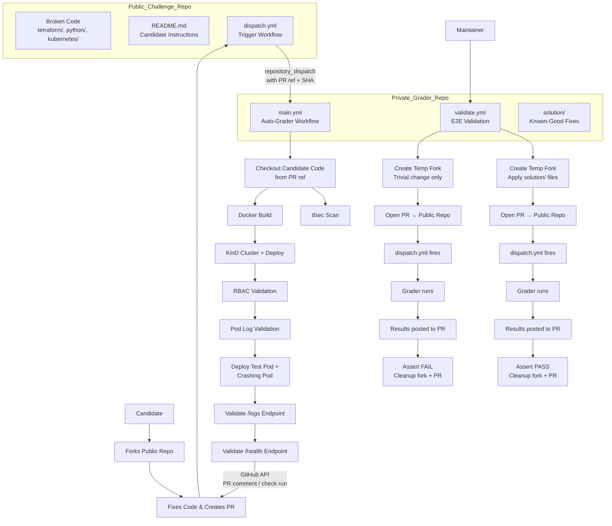
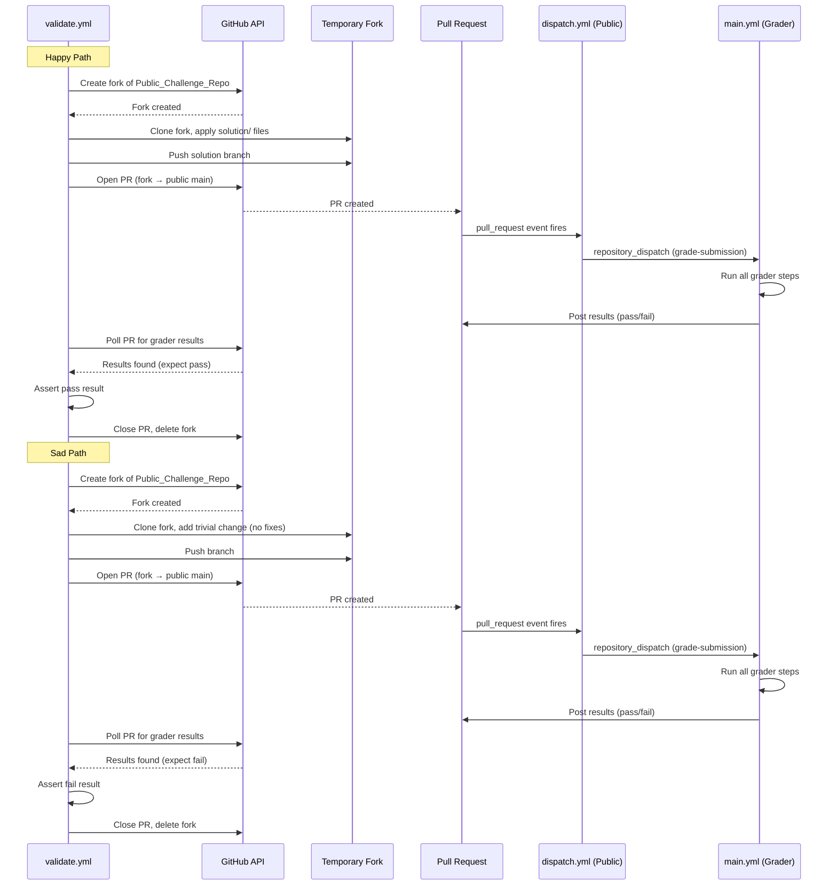

# Design Document: DevOps Hiring Challenge

## Overview

This design describes a two-repository architecture for an automated technical screening challenge for Senior DevOps Engineer candidates. A public challenge repository contains intentionally broken infrastructure code spanning four domains: Terraform, Docker, Kubernetes, and Python. The Python component is a Flask-based microservice that aggregates pod logs with severity filtering and reports pod health status via HTTP endpoints — intentionally broken so candidates must fix authentication, API calls, and endpoint logic. A private grader repository contains all grading logic, the solution directory, and the end-to-end validation workflow.

When a candidate forks the public repo, fixes the issues, and creates a pull request, a lightweight dispatch workflow in the public repo triggers the auto-grader in the private repo via `repository_dispatch`. The private grader checks out the candidate's code, runs all grading steps (security scans, container builds, ephemeral KinD cluster deployment, RBAC and log validation), and reports results back to the candidate's PR via the GitHub API.

This architecture ensures:
- Candidates never see the grading criteria, solution files, or grading logic
- The public repo contains only the broken code, README, and a thin dispatch workflow
- The private repo owns all evaluation logic and can be updated without affecting the public repo
- Results are posted back to the candidate's PR as comments or check runs

## Architecture

The system uses a two-repository architecture. The public repo is candidate-facing; the private repo contains all grading logic. Cross-repo communication uses GitHub's `repository_dispatch` API and a shared PAT for authentication.



### Key Architectural Decisions

1. **Two-repo separation**: Grading logic, solution files, and the grader workflow live in a private repo. Candidates only see the public repo with broken code and a dispatch trigger. This prevents reverse-engineering of grading criteria.
2. **`repository_dispatch` for cross-repo triggering**: The public repo's dispatch workflow sends a `repository_dispatch` event to the private repo, passing the candidate's PR ref and metadata. This is the standard GitHub mechanism for cross-repo workflow triggers.
3. **PAT-based authentication**: A GitHub Personal Access Token (or GitHub App token) stored as secrets in both repos enables the dispatch call and the result reporting back to the PR.
4. **KinD for ephemeral K8s testing**: KinD clusters are lightweight, run entirely in Docker, and are disposable — ideal for CI. No external cluster or cloud credentials needed.
5. **`imagePullPolicy: Never`**: Since the Docker image is loaded directly into KinD via `kind load docker-image`, no registry is needed.
6. **No cloud credentials required**: Terraform is scanned statically with tfsec (no `terraform plan/apply`). K8s runs locally in KinD.
7. **Results posted via GitHub API**: The private grader posts results back to the candidate's PR as a comment or check run, so candidates see feedback directly on their PR without needing access to the private repo.

## Components and Interfaces

### Repository File Structure

**Public Challenge Repo** (candidate-facing):
```
├── README.md                          # Candidate instructions (Req 1)
├── terraform/
│   └── main.tf                        # Broken Terraform module (Req 2)
├── python/
│   ├── app.py                         # Broken Python app (Req 4)
│   ├── requirements.txt               # Python dependencies (Req 4.4)
│   └── Dockerfile                     # Bad Dockerfile (Req 3)
├── kubernetes/
│   ├── deployment.yaml                # Deployment missing serviceAccountName (Req 5)
│   └── rbac.yaml                      # Empty file — candidate fills in (Req 6)
└── .github/
    └── workflows/
        └── dispatch.yml               # Cross-repo dispatch trigger (Req 9)
```

**Private Grader Repo** (not visible to candidates):
```
├── .github/
│   └── workflows/
│       ├── main.yml                   # Auto-grader pipeline (Req 7)
│       └── validate.yml               # E2E validation workflow (Req 8)
├── grader/
│   ├── test-logger-pod.yaml           # Test pod that emits ERROR/WARN/INFO logs
│   └── crash-pod.yaml                 # Deliberately crashing pod for health check validation
└── solution/
    ├── terraform/
    │   └── main.tf                    # Fixed Terraform (Req 8.5)
    ├── python/
    │   ├── app.py                     # Fixed Python app with Flask endpoints (Req 8.5)
    │   ├── requirements.txt           # Updated deps: kubernetes + flask (Req 8.5)
    │   └── Dockerfile                 # Production Dockerfile (Req 8.5)
    └── kubernetes/
        ├── deployment.yaml            # Deployment with serviceAccountName (Req 8.5)
        └── rbac.yaml                  # Complete RBAC resources (Req 8.5)
```


### Component 1: README.md (Candidate Instructions — Public Repo)

The README lives in the Public Challenge Repo and serves as the sole interface between the challenge and the candidate. It must:
- Describe all four tasks clearly with what is broken and what the expected fix is
- Instruct candidates to fork the public repo, make fixes, and open a PR back against it
- Explain that creating a pull request triggers automated grading
- Not reveal the exact grading checks (candidates should reason about correctness)
- Not mention the existence of the private grader repo

### Component 2: terraform/main.tf (Broken Terraform Module)

The Terraform file defines AWS resources with intentional security and cost issues:

| Issue | What's Wrong | Expected Fix |
|-------|-------------|--------------|
| Open security group | Ingress `0.0.0.0/0` on all ports (`0-65535`) | Restrict CIDR and port range |
| Missing VPC reference | `aws_security_group` lacks `vpc_id` | Add `vpc_id` attribute |
| Oversized instance | EKS node group uses `m5.24xlarge` | Use a reasonable instance type (e.g., `m5.large`) |

The file uses `aws` provider with a placeholder region. No `terraform init` or `apply` is needed — tfsec performs static analysis only.

```hcl
provider "aws" {
  region = "us-east-1"
}

resource "aws_security_group" "eks_sg" {
  name        = "eks-cluster-sg"
  description = "EKS cluster security group"

  ingress {
    from_port   = 0
    to_port     = 65535
    protocol    = "tcp"
    cidr_blocks = ["0.0.0.0/0"]
  }
}

resource "aws_eks_node_group" "workers" {
  cluster_name    = "devops-challenge"
  node_group_name = "workers"
  node_role_arn   = "arn:aws:iam::role/eks-node-role"
  subnet_ids      = ["subnet-placeholder"]
  instance_types  = ["m5.24xlarge"]

  scaling_config {
    desired_size = 2
    max_size     = 3
    min_size     = 1
  }
}
```

### Component 3: python/Dockerfile (Bad Dockerfile)

The Dockerfile uses anti-patterns that a senior engineer should recognize:

| Anti-Pattern | What's Wrong | Expected Fix |
|-------------|-------------|--------------|
| Fat base image | `ubuntu:latest` | Use `python:3.11-slim` or distroless |
| Runs as root | No `USER` directive | Add non-root user |
| No multi-stage build | Single stage with full OS | Multi-stage or slim base |
| Mutable tag | `latest` tag | Pin specific version |

```dockerfile
FROM ubuntu:latest
RUN apt-get update && apt-get install -y python3 python3-pip
COPY requirements.txt .
RUN pip3 install -r requirements.txt
COPY app.py .
EXPOSE 8080
CMD ["python3", "app.py"]
```

### Component 4: python/app.py (Broken Python Application)

The Python app is a Flask-based microservice with two features: log aggregation with severity filtering and pod health reporting. The broken version has authentication bugs, wrong API calls, and incomplete endpoint logic.

**Intentional Bugs (Broken Version):**

| Bug | What's Wrong | Expected Fix |
|-----|-------------|--------------|
| Auth method | Uses `load_kube_config()` (local kubeconfig) | Use `load_incluster_config()` |
| API calls | Calls `list_node()` instead of correct pod/log APIs | Use `list_namespaced_pod()` and `read_namespaced_pod_log()` |
| `/logs` endpoint | Handler is a skeleton — returns empty JSON or crashes | Implement log reading, severity filtering (ERROR/WARN only), return structured JSON |
| `/health` endpoint | Handler doesn't check pod statuses | Query pod statuses, detect `CrashLoopBackOff`/`Error` states, return JSON report |
| Error handling | Missing try/except around K8s API calls | Add proper error handling |

**Broken Version Structure:**

```python
from kubernetes import client, config
from flask import Flask, jsonify
import threading

app = Flask(__name__)

def init_kube():
    config.load_kube_config()  # BUG: should be load_incluster_config()
    return client.CoreV1Api()

v1 = None

@app.route('/health')
def health():
    # BUG: doesn't check pod statuses
    return jsonify({"status": "ok"})

@app.route('/logs')
def logs():
    # BUG: calls list_node() instead of reading pod logs
    # Returns empty/broken response
    result = v1.list_node()
    return jsonify({"entries": []})

def startup():
    global v1
    v1 = init_kube()
    result = v1.list_node()  # BUG: should be list_namespaced_pod()
    print(f"Found {len(result.items)} items")

if __name__ == "__main__":
    startup()
    app.run(host="0.0.0.0", port=8080)
```

**Fixed Version Behavior:**

When fixed, the app must:
1. Use `load_incluster_config()` for in-cluster authentication
2. On startup, call `list_namespaced_pod("default")`, print `"SUCCESS: Found pods in namespace"` to stdout
3. Serve Flask on port 8080
4. `/logs` endpoint: Read logs from all pods in the namespace using `read_namespaced_pod_log()`, filter entries containing `ERROR` or `WARN` severity, return structured JSON like `{"entries": [{"pod": "...", "line": "...", "severity": "ERROR"}, ...]}`
5. `/health` endpoint: List pods via `list_namespaced_pod()`, check each pod's container statuses for `CrashLoopBackOff` or `Error` waiting/terminated reasons, return JSON like `{"status": "ok"|"degraded", "pods": [{"name": "...", "healthy": true|false, "reason": "..."}]}`
6. Handle `kubernetes.client.ApiException` and `kubernetes.config.ConfigException` gracefully

### Component 5: kubernetes/deployment.yaml

The Deployment manifest is mostly correct but intentionally omits `serviceAccountName`:

```yaml
apiVersion: apps/v1
kind: Deployment
metadata:
  name: log-reader-app
  namespace: default
spec:
  replicas: 1
  selector:
    matchLabels:
      app: log-reader-app
  template:
    metadata:
      labels:
        app: log-reader-app
    spec:
      containers:
        - name: log-reader
          image: log-reader-app:latest
          imagePullPolicy: Never
          ports:
            - containerPort: 8080
```

The grader uses `kubectl port-forward` to reach the Flask endpoints, so no Service resource is strictly required. However, the candidate may optionally add one.

### Component 6: kubernetes/rbac.yaml (Blank)

Ships as an empty file. The candidate must author three resources from scratch:

1. **ServiceAccount** named `log-monitor` in `default` namespace
2. **Role** granting `get`, `list`, `watch` on `pods` and `pods/log` resources (the `pods/log` permission is required for the log aggregation feature in the Python app)
3. **RoleBinding** binding the Role to the `log-monitor` ServiceAccount

### Component 7: .github/workflows/main.yml (Auto-Grader — Private Repo)

The auto-grader lives in the Private Grader Repo and is triggered by `repository_dispatch` events from the public repo's dispatch workflow. It receives the candidate's PR metadata, checks out their code, runs all grading steps, and reports results back.

**Trigger Configuration:**
```yaml
on:
  repository_dispatch:
    types: [grade-submission]
```

**Dispatch Payload Schema:**
The workflow expects `client_payload` with:
- `pr_repo`: The candidate's fork repository clone URL
- `pr_ref`: The candidate's PR head SHA or branch ref
- `pr_number`: The PR number on the Public Challenge Repo
- `public_repo`: The full name of the Public Challenge Repo (e.g., `org/devops-challenge`)

```mermaid
graph LR
    A[Receive Dispatch] --> B[Checkout Candidate Code]
    B --> C[tfsec Scan]
    C --> D[Docker Build]
    D --> E[Create KinD Cluster]
    E --> F[Load Image to KinD]
    F --> G[Apply K8s Manifests]
    G --> H[Wait for Rollout]
    H --> I[Validate RBAC]
    I --> J[Validate Pod Logs]
    J --> J2[Deploy Test Pod +<br>Crashing Pod]
    J2 --> J3[Wait for Test Pods]
    J3 --> J4[Port-Forward to App]
    J4 --> J5[Validate /logs Endpoint]
    J5 --> J6[Validate /health Endpoint]
    J6 --> K[Post Results to PR]
```



**Step Details:**

| Step | Command / Action | Validates |
|------|-----------------|-----------|
| Receive Dispatch | Triggered by `repository_dispatch` type `grade-submission` | Req 7.1 |
| Checkout Candidate Code | `actions/checkout` with `repository: ${{ github.event.client_payload.pr_repo }}` and `ref: ${{ github.event.client_payload.pr_ref }}` | Req 7.2, 7.3 |
| tfsec Scan | `aquasecurity/tfsec-action` or `tfsec terraform/` | Req 7.4 |
| Docker Build | `docker build -t log-reader-app:latest python/` | Req 7.5 |
| Create KinD Cluster | `kind create cluster` | Req 7.6 |
| Load Image | `kind load docker-image log-reader-app:latest` | Req 7.6 |
| Apply Manifests | `kubectl apply -f kubernetes/` | Req 7.6 |
| Wait Rollout | `kubectl rollout status deployment/log-reader-app --timeout=120s` | Req 7.7 |
| Validate SA exists | `kubectl get sa log-monitor -n default` | Req 7.8 |
| Validate RBAC allow | `kubectl auth can-i get pods/log --as=system:serviceaccount:default:log-monitor` | Req 7.9 |
| Validate RBAC deny | `kubectl auth can-i delete pods --as=system:serviceaccount:default:log-monitor` | Req 7.10 |
| Validate Logs | `kubectl logs deployment/log-reader-app \| grep "SUCCESS: Found pods in namespace"` | Req 7.11 |
| Deploy Test Pod | `kubectl run test-logger --image=busybox -- sh -c 'while true; do echo "ERROR: disk full"; echo "WARN: high memory"; echo "INFO: heartbeat"; sleep 5; done'` | Req 7.12 |
| Deploy Crashing Pod | `kubectl run crash-pod --image=busybox -- sh -c 'exit 1'` (enters CrashLoopBackOff) | Req 7.13 |
| Wait for Test Pods | `sleep 30` — allow test-logger to produce log lines and crash-pod to enter CrashLoopBackOff | Req 7.12, 7.13 |
| Port-Forward | `kubectl port-forward deployment/log-reader-app 8080:8080 &` | Req 7.14, 7.15 |
| Validate /logs | `curl localhost:8080/logs` — assert valid JSON, contains ERROR/WARN entries from test-logger, does NOT contain INFO entries | Req 7.14 |
| Validate /health | `curl localhost:8080/health` — assert valid JSON, identifies crash-pod as unhealthy | Req 7.15 |
| Post Results | GitHub API: create PR comment or check run on the Public Challenge Repo PR | Req 7.16 |

**Result Reporting:**
After all grading steps complete, the workflow uses the GitHub API to post results back to the candidate's PR:
- Uses the Cross_Repo_PAT (stored as a secret `CROSS_REPO_TOKEN` in the private repo) to authenticate
- Creates a PR comment summarizing which checks passed/failed
- Optionally creates a GitHub Check Run with detailed annotations
- The comment should list each grading area (Terraform, Docker, K8s RBAC, Python) with pass/fail status

**Design Decisions:**
- tfsec step uses `continue-on-error: true` so the pipeline continues to grade other areas even if Terraform has issues. The step's exit code is still captured for reporting.
- Rollout timeout of 120 seconds gives the pod time to start and run the Python script.
- RBAC validation uses `kubectl auth can-i` with `--as` impersonation — no need to exec into the pod.
- Candidate code is checked out from the PR ref, not from the private repo itself.

### Component 8: .github/workflows/validate.yml (E2E Validation — Private Repo)

The validation workflow lives in the Private Grader Repo and is triggered manually (`workflow_dispatch`). Instead of overlaying solution files locally, it simulates the real candidate experience by creating temporary forks, pushing code, opening PRs, and waiting for the full cross-repo dispatch chain to fire and report results.



**Phase 1 — Solution Validation (Happy Path):**
1. Use the GitHub API (via `gh` CLI or `curl`) to create a temporary fork of the Public Challenge Repo
2. Clone the fork locally in the CI runner
3. Apply `solution/` files onto the fork's working tree (copy `solution/terraform/main.tf` → `terraform/main.tf`, etc.)
4. Commit and push the changes to a uniquely named branch (e.g., `validate-solution-${{ github.run_id }}`)
5. Open a PR from the fork's branch against the Public Challenge Repo's `main` branch
6. Poll the PR (via GitHub API) for grader results — check for a check run or PR comment posted by the auto-grader
7. Assert the PR received a "pass" result
8. Clean up: close the PR, delete the remote branch, delete the fork via the GitHub API

**Phase 2 — Broken Code Validation (Sad Path):**
1. Create a temporary fork of the Public Challenge Repo
2. Clone the fork, make a trivial change (e.g., add a comment to README) without applying solution fixes
3. Push to a uniquely named branch (e.g., `validate-broken-${{ github.run_id }}`)
4. Open a PR from the fork against the Public Challenge Repo's `main` branch
5. Poll the PR for grader results
6. Assert the PR received a "fail" result
7. Clean up: close the PR, delete the remote branch, delete the fork

**Polling and Timeout:**
- The workflow polls the PR every 30 seconds for grader results
- Checks for either a check run with a conclusion or a PR comment matching a known pattern (e.g., containing "Grading Results")
- Timeout after ~10 minutes (20 poll iterations × 30s) — if no results appear, the job fails with a timeout error
- Polling uses `gh api` or `curl` with the GitHub REST API

**Design Decisions:**
- Two sequential jobs in the workflow: `validate-solution` runs first, then `validate-broken` (using `needs: validate-solution`)
- Sequential execution avoids race conditions where two PRs trigger the grader simultaneously
- Each job creates and destroys its own fork — full isolation between runs
- Unique branch names (using `github.run_id`) prevent conflicts with concurrent workflow runs
- The PAT requires `repo`, `delete_repo`, and `workflow` scopes: `repo` for fork/PR operations, `delete_repo` for fork cleanup, `workflow` for triggering dispatch
- Both jobs run on `ubuntu-latest`
- Cleanup runs in an `always()` step to ensure forks and PRs are cleaned up even on failure
- This approach tests the entire cross-repo dispatch chain end-to-end, not just the grading logic in isolation

### Component 9: .github/workflows/dispatch.yml (Cross-Repo Trigger — Public Repo)

The dispatch workflow is the only GitHub Actions workflow in the Public Challenge Repo. It listens for `pull_request` events and triggers the private grader.

**Trigger Configuration:**
```yaml
on:
  pull_request:
    branches: [main]
```

**Workflow Steps:**

| Step | Action | Purpose |
|------|--------|---------|
| Set pending status | GitHub API: create pending check run or PR comment | Inform candidate grading has started (Req 9.6) |
| Dispatch to private repo | `peter-evans/repository-dispatch@v3` or GitHub API POST to `/repos/{owner}/{private-repo}/dispatches` | Trigger grader (Req 9.2) |

**Dispatch Payload:**
```json
{
  "event_type": "grade-submission",
  "client_payload": {
    "pr_repo": "${{ github.event.pull_request.head.repo.clone_url }}",
    "pr_ref": "${{ github.event.pull_request.head.sha }}",
    "pr_number": "${{ github.event.pull_request.number }}",
    "public_repo": "${{ github.repository }}"
  }
}
```

**Authentication:**
- Uses a `CROSS_REPO_TOKEN` secret (PAT with `repo` scope) to authenticate the dispatch API call
- The same token (or a separate one) is used by the private grader to post results back

**Design Decisions:**
- The workflow is intentionally minimal — no grading logic, no solution references
- Uses `peter-evans/repository-dispatch` action for simplicity, or a direct `curl` call to the GitHub API
- The PAT must have `repo` scope to trigger workflows in the private repo
- Triggers on both `opened` and `synchronize` PR events so re-pushes re-trigger grading

### Cross-Repo Token Setup

Both repos need a GitHub PAT (or GitHub App token) configured:

| Repo | Secret Name | Token Scope | Used For |
|------|-------------|-------------|----------|
| Public Challenge Repo | `CROSS_REPO_TOKEN` | `repo` | Dispatching `repository_dispatch` to the private repo |
| Private Grader Repo | `CROSS_REPO_TOKEN` | `repo` | Checking out candidate code from the public repo's PR, posting results back to the PR |
| Private Grader Repo | `VALIDATE_PAT` | `repo`, `delete_repo`, `workflow` | E2E validation workflow: creating/deleting temporary forks, opening/closing PRs, triggering dispatch |

A single PAT with `repo` scope on both repos is sufficient for the dispatch and grading flows. The E2E validation workflow requires a separate (or extended) PAT with `delete_repo` and `workflow` scopes for fork lifecycle management. Alternatively, a GitHub App can be used for finer-grained permissions.

## Data Models

This project has no runtime data models or databases. The "data" is the set of static files in the repository. The key data structures are:

### Terraform Resource Model (terraform/main.tf)

| Resource | Key Attributes | Intentional Issue |
|----------|---------------|-------------------|
| `aws_security_group.eks_sg` | `name`, `description`, `ingress` | Missing `vpc_id`; ingress open to `0.0.0.0/0` on all ports |
| `aws_eks_node_group.workers` | `cluster_name`, `instance_types`, `scaling_config` | `instance_types = ["m5.24xlarge"]` (oversized) |

### Kubernetes Resource Model

| Resource | Kind | Name | Namespace | Key Fields |
|----------|------|------|-----------|------------|
| Deployment | `apps/v1/Deployment` | `log-reader-app` | `default` | `image: log-reader-app:latest`, `imagePullPolicy: Never`, missing `serviceAccountName` |
| ServiceAccount | `v1/ServiceAccount` | `log-monitor` | `default` | Created by candidate |
| Role | `rbac.authorization.k8s.io/v1/Role` | (candidate-defined) | `default` | `verbs: [get, list, watch]`, `resources: [pods, pods/log]` |
| RoleBinding | `rbac.authorization.k8s.io/v1/RoleBinding` | (candidate-defined) | `default` | Binds Role to `log-monitor` SA |

### Python Dependencies (python/requirements.txt)

```
kubernetes==28.1.0
flask==3.0.0
```

### GitHub Actions Workflow Triggers

| Workflow | File | Repo | Trigger |
|----------|------|------|---------|
| Dispatch | `.github/workflows/dispatch.yml` | Public Challenge Repo | `on: pull_request` (targeting `main` branch) |
| Auto-Grader | `.github/workflows/main.yml` | Private Grader Repo | `on: repository_dispatch` (type: `grade-submission`) |
| E2E Validation | `.github/workflows/validate.yml` | Private Grader Repo | `on: workflow_dispatch` |


## Correctness Properties

*A property is a characteristic or behavior that should hold true across all valid executions of a system — essentially, a formal statement about what the system should do. Properties serve as the bridge between human-readable specifications and machine-verifiable correctness guarantees.*

Most acceptance criteria in this project are specific structural checks on known files (e.g., "the Dockerfile uses ubuntu:latest") or workflow YAML structure checks. These are best validated as example-based tests rather than property-based tests, since the inputs are fixed files, not generated data.

The following properties capture the universal invariants that must hold:

### Property 1: RBAC Role permission completeness

*For any* required verb in `{get, list, watch}` and *for any* required resource in `{pods, pods/log}`, the solution Role manifest must include that verb-resource combination in its rules.

**Validates: Requirements 6.3**

### Property 2: Solution passes full E2E dispatch chain

*For any* run of the E2E validation workflow's happy path, when the known-good solution files from `solution/` are applied to a temporary fork and a PR is opened against the Public Challenge Repo, the cross-repo dispatch chain must fire, the auto-grader must run, and the PR must receive a "pass" result within the timeout period.

**Validates: Requirements 8.4, 8.5, 8.6, 8.7, 8.8**

### Property 3: Broken code fails full E2E dispatch chain

*For any* run of the E2E validation workflow's sad path, when unfixed code with only a trivial change is pushed to a temporary fork and a PR is opened against the Public Challenge Repo, the cross-repo dispatch chain must fire, the auto-grader must run, and the PR must receive a "fail" result.

**Validates: Requirements 8.10, 8.11**

### Property 4: Log severity filtering

*For any* set of pod log lines containing a mix of ERROR, WARN, and INFO severity entries, the `/logs` endpoint must return only entries with ERROR or WARN severity. The response must not contain any INFO-level entries, and every ERROR/WARN line from the source logs must appear in the response.

**Validates: Requirements 4.5, 4.9**

### Property 5: Pod health detection

*For any* set of pods in the namespace where one or more pods are in `CrashLoopBackOff` or `Error` state, the `/health` endpoint must identify each unhealthy pod by name and report it as unhealthy. Pods in `Running` state must be reported as healthy.

**Validates: Requirements 4.6, 4.10**

## Error Handling

### Dispatch Workflow (dispatch.yml — Public Repo)

| Failure Scenario | Handling Strategy |
|-----------------|-------------------|
| Cross-repo dispatch fails (PAT invalid/expired) | Workflow fails with authentication error. Maintainer must rotate the `CROSS_REPO_TOKEN` secret. |
| Private repo is unreachable | Dispatch API call returns 404/403. Workflow fails — maintainer should verify repo name and token permissions. |
| PR from a fork with restricted permissions | GitHub Actions on forks have limited secret access. The `CROSS_REPO_TOKEN` must be available to the workflow (use `pull_request_target` if needed for fork PRs, with appropriate security precautions). |

### Auto-Grader Pipeline (main.yml — Private Repo)

| Failure Scenario | Handling Strategy |
|-----------------|-------------------|
| tfsec finds issues | Step uses `continue-on-error: true` so remaining checks still run. Findings are reported in step output. |
| Docker build fails | Pipeline fails immediately — subsequent K8s steps cannot proceed without an image. |
| KinD cluster creation fails | Pipeline fails — infrastructure issue, not candidate's fault. Retry is appropriate. |
| `kind load docker-image` fails | Pipeline fails — image must be available in KinD for deployment. |
| `kubectl apply` fails | Pipeline fails — YAML syntax or structural errors in candidate's manifests. |
| Deployment rollout timeout | Step fails after 120s — indicates pod crash loop or image issue. Candidate should check pod events/logs. |
| RBAC validation fails | `kubectl auth can-i` returns "no" when "yes" expected (or vice versa). Step fails with clear output. |
| Pod log grep fails | `kubectl logs` output doesn't contain expected string. Step fails — candidate's Python fix is incomplete. |
| Candidate code checkout fails | PR ref is invalid or repo is inaccessible. Workflow fails — dispatch payload may be malformed. |
| Result posting fails | GitHub API call to post PR comment/check run fails. Grading still completes but candidate doesn't see results. Maintainer should check token permissions. |

### Validation Workflow (validate.yml — Private Repo)

| Failure Scenario | Handling Strategy |
|-----------------|-------------------|
| Fork creation fails | GitHub API returns error (e.g., rate limit, permissions). Workflow fails immediately with a descriptive error. Maintainer should check PAT scopes (`repo` required). |
| Clone or push to fork fails | Git operation fails — likely a permissions or network issue. Workflow fails. Cleanup step still attempts to delete the fork. |
| PR creation fails | GitHub API error. Workflow fails. Cleanup step still attempts to delete the fork. |
| Dispatch workflow doesn't fire | The PR was created but no `repository_dispatch` event was sent. Polling will timeout after ~10 minutes. Maintainer should verify `dispatch.yml` is present in the public repo and the PAT has `workflow` scope. |
| Grader doesn't post results (timeout) | Polling loop exhausts ~10 minutes without finding results. Workflow fails with a timeout error. Maintainer should check that `main.yml` in the private repo is triggered and that the `CROSS_REPO_TOKEN` allows posting back to the PR. |
| Happy path receives "fail" instead of "pass" | Workflow exits non-zero indicating the solution files are not passing the grader. The `solution/` directory may be out of sync with the grader checks. |
| Sad path receives "pass" instead of "fail" | Workflow exits non-zero indicating the grader is not catching issues (Req 8.17). The broken code may have been accidentally fixed or grader checks are too lenient. |
| Fork cleanup fails | `delete_repo` API call fails (PAT missing `delete_repo` scope). Workflow logs a warning but does not fail the overall run — orphaned forks should be cleaned up manually. |
| Infrastructure failure (GitHub API outage) | Workflow fails with API errors. Maintainer should retry. Cleanup step runs in `always()` to minimize orphaned resources. |

### Python App (app.py) Error Handling

The fixed Python app should handle:
- `kubernetes.config.ConfigException` — if in-cluster config is unavailable (not running in a pod)
- `kubernetes.client.ApiException` — if the API call fails (e.g., RBAC not configured, pod not found, log read fails)
- General exceptions — catch-all with meaningful error message
- `/logs` endpoint: Return `{"entries": [], "error": "..."}` with HTTP 500 if log reading fails
- `/health` endpoint: Return `{"status": "error", "message": "..."}` with HTTP 500 if pod status check fails

The broken version intentionally does NOT handle these errors and has incomplete endpoint logic, which is part of the challenge.

## Testing Strategy

### Dual Testing Approach

This project uses both example-based tests and property-based tests:

- **Example tests**: Verify specific file contents, structural checks on known files, workflow YAML structure, and integration behavior
- **Property tests**: Verify universal invariants that must hold across all valid inputs

### Example-Based Tests

Most acceptance criteria are best tested as examples since they check specific, known file contents:

| Test Category | What to Verify | Criteria |
|--------------|----------------|----------|
| README content | File exists, mentions four tasks, mentions auto-grading via PR, mentions forking | 1.1, 1.3, 1.4 |
| Terraform broken state | Security group has `0.0.0.0/0`, missing `vpc_id`, `m5.24xlarge` | 2.1, 2.2, 2.3 |
| tfsec detects issues | Running tfsec on broken terraform/ returns findings | 2.4 |
| Dockerfile anti-patterns | Uses `ubuntu:latest`, no USER, no multi-stage, has COPY/pip/CMD | 3.1–3.5 |
| Python app bugs | Uses `load_kube_config()`, calls `list_node()`, `/logs` returns empty, `/health` doesn't check statuses | 4.1, 4.2, 4.7, 4.8 |
| Python app fix | Solution app.py contains "SUCCESS: Found pods in namespace", Flask serves on port 8080 | 4.3, 4.11 |
| requirements.txt | Contains `kubernetes==28.1.0` and `flask` | 4.4 |
| Deployment manifest | Named `log-reader-app`, image matches, missing `serviceAccountName`, `imagePullPolicy: Never` | 5.1–5.4 |
| RBAC blank | `kubernetes/rbac.yaml` is empty | 6.1 |
| Solution RBAC | Contains ServiceAccount `log-monitor`, RoleBinding | 6.2, 6.4 |
| Grader workflow structure (private repo) | `main.yml` triggers on `repository_dispatch` type `grade-submission`, references dispatch payload fields, contains all grading steps including test pod deployment, endpoint validation, and result posting | 7.1–7.16 |
| Dispatch workflow structure (public repo) | `dispatch.yml` triggers on `pull_request`, dispatches to private repo with correct payload, uses secret for auth, contains no grading logic | 9.1–9.6 |
| Validation workflow (private repo) | `validate.yml` exists, triggers on `workflow_dispatch`, creates temporary forks, opens PRs, polls for grader results, asserts pass/fail, cleans up forks | 8.1, 8.2, 8.3, 8.4, 8.5, 8.13, 8.14 |

### Property-Based Tests

Property-based tests use a PBT library to verify universal invariants. Since this project is primarily static files and CI workflows, the property tests focus on:

**Library**: `hypothesis` (Python) for testing RBAC permission completeness, log filtering, pod health detection, and grader behavior.

**Configuration**: Minimum 100 iterations per property test.

**Property Test 1: RBAC Role permission completeness**
- Generate random subsets of `{get, list, watch}` × `{pods, pods/log}` and verify the solution Role includes all required combinations
- Tag: **Feature: devops-hiring-challenge, Property 1: RBAC Role permission completeness**

**Property Test 2: Solution passes full E2E dispatch chain**
- This is an integration property validated by the `validate.yml` workflow's happy path — the workflow creates a temporary fork, applies solution files, opens a PR, waits for the full dispatch chain to fire, and asserts the grader posts a "pass" result
- Tag: **Feature: devops-hiring-challenge, Property 2: Solution passes full E2E dispatch chain**

**Property Test 3: Broken code fails full E2E dispatch chain**
- This is an integration property validated by the `validate.yml` workflow's sad path — the workflow creates a temporary fork with only a trivial change, opens a PR, waits for the dispatch chain, and asserts the grader posts a "fail" result
- Tag: **Feature: devops-hiring-challenge, Property 3: Broken code fails full E2E dispatch chain**

**Property Test 4: Log severity filtering**
- Generate random sets of log lines with mixed severities (ERROR, WARN, INFO, DEBUG). Pass them through the log filtering function. Assert the output contains only ERROR and WARN entries and that no INFO/DEBUG entries are present.
- Tag: **Feature: devops-hiring-challenge, Property 4: Log severity filtering**

**Property Test 5: Pod health detection**
- Generate random sets of pod status objects where some pods are in `CrashLoopBackOff`, `Error`, or `Running` states. Pass them through the health check function. Assert that every unhealthy pod is reported as unhealthy and every healthy pod is reported as healthy.
- Tag: **Feature: devops-hiring-challenge, Property 5: Pod health detection**

### Integration Testing

The `validate.yml` workflow in the Private Grader Repo serves as the primary integration test suite, testing the entire cross-repo dispatch chain end-to-end:
- **Happy path**: Create a temporary fork → apply solution files → open PR → wait for dispatch + grader → assert pass → cleanup fork
- **Sad path**: Create a temporary fork → trivial change only → open PR → wait for dispatch + grader → assert fail → cleanup fork
- This validates not just the grading logic, but the full candidate experience: fork → PR → dispatch → grade → results posted
- Triggered manually via `workflow_dispatch` before sharing the public repo with candidates
- Requires a PAT with `repo`, `delete_repo`, and `workflow` scopes

### Test Execution

- Example tests: Run as part of a local test suite (e.g., `pytest`) that parses and validates file contents from both repos
- Property tests: Run via `pytest` with `hypothesis` for RBAC validation
- Integration tests: Run via `validate.yml` in the Private Grader Repo's GitHub Actions
- Cross-repo integration: Manually test the dispatch flow end-to-end before sharing with candidates
- Each property test must reference its design document property with the tag format specified above
